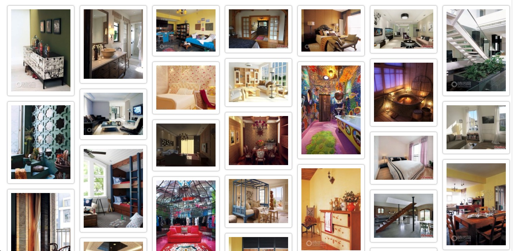

# 网上学习制作瀑布流
## 运用js，jq实现不一样的瀑布流

### js文件 waterfullfall.js ，jq文件为 jq.water.js
注意：先确定第一排有几个图片，几个图片所占长宽，再确定总共大小。再以几个图片高度最短的。把后面的图片以绝对定位加入到后面。并对这个当前图片高度加长。

### style.css 对页面的布局， reset.css 对页面的重置
 其中注意每一个box以padding隔开，box里面也是padding为内边距，border与图片相隔开


```
function waterfall() {
    var $boxs = $( ".box" );
    var w = $boxs.eq(0).outerWidth();
    var cols = Math.floor($(window).width()/ w);

    $("#main").width(w * cols).css('margin', '0 auto');

    var hArr = [];
    $boxs.each(function (index, value) {
            var h = $boxs.eq(index).outerHeight();
            if (index < cols) {
                hArr[index] = h;
            }
            else {
                var minH = Math.min.apply(null, hArr);
                var minIndex = $.inArray(minH, hArr);
                $(value).css(
                    {
                        'position':'absolute',
                        'top':minH+'px',
                        'left':minIndex*w+'px',
                    }
                );
                hArr[minIndex]+=$boxs.eq(index).outerHeight();
            }
        })
}
```
### 当页面划过最底下，刷新新的图片

```
function scrollchange() {
    var $boxs = $( ".box" );
    var $boxlas=$boxs.last();

    var $boxt=$boxlas.offset().top+Math.floor($boxlas.height()/2);
    var $scrollT=$(window).scrollTop();
    var $sceen=$(document).height();
    return ($boxt<$scrollT+$sceen)?true:false;
}
```




